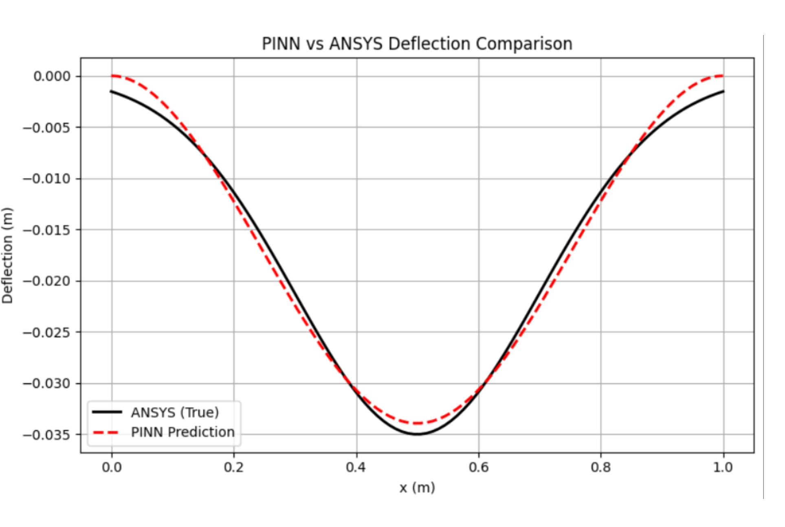
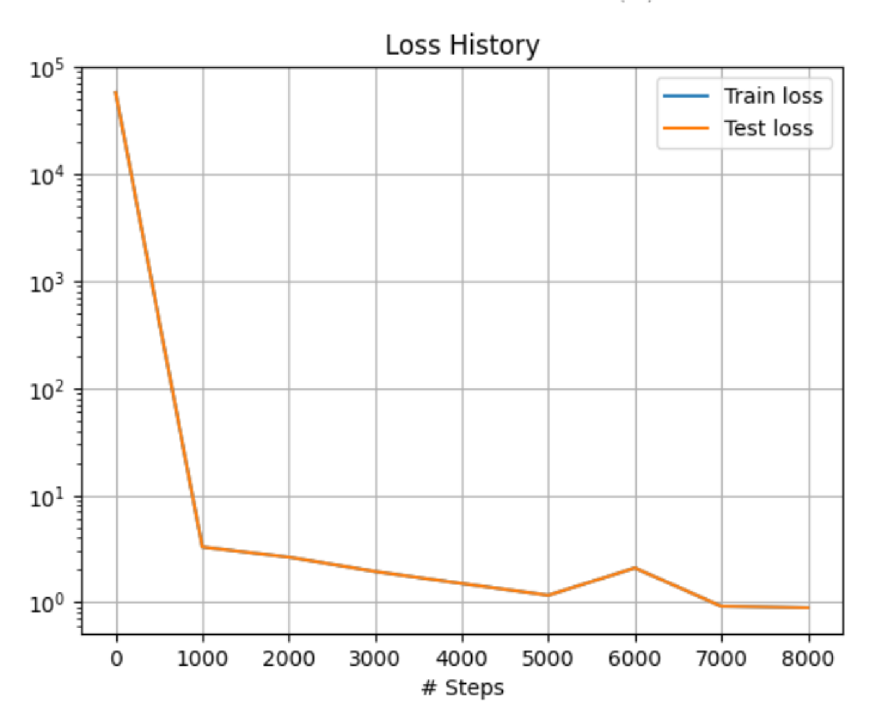

# PINN for Solid Mechanics

<p align="center">
  
</p>

<p align="center">
  <b>Amrita Vishwa Vidyapeetham</b><br/>
  Physics-Informed Neural Networks for Structural Mechanics<br/>
  2nd Semester Group Project — GROUP 17
</p>

---


## 📚 Courses

| Course | Code |
|--------|------|
| Introduction to Materials Informatics | 23CHY115 |
| Computational Mechanics 2 | 23PHY114 |
| Mathematics for Intelligent Systems 2 | 23MAT112 |

---

## 📌 Problem Statement

This project explores the use of **Physics-Informed Neural Networks (PINNs)** to model how a mechanical structure — like a beam or a plate — deforms under a known load. By embedding the physics of the problem directly into the neural network, we predict displacement across the structure **without relying on a traditional mesh**.

To ensure accuracy, we compare predictions with **ANSYS Mechanical 2025 R1** (a well-established FEM tool). This approach blends machine learning with classical physics for faster, mesh-free structural analysis.

---

## 🔄 Methodology

```
DEFINE PROBLEM          SET INITIAL &         DESIGN NEURAL        TRAIN THE PINN
DOMAIN & GEOMETRY  →   BOUNDARY          →   NETWORK          →   USING OPTIMIZER
                        CONDITIONS            ARCHITECTURE
                                                                        ↓
VALIDATE                OBTAIN                ANALYSIS &           RUN SIMULATION
PREDICTIONS        ←   SOLUTION          ←   VISUALIZATION    ←   IN ANSYS
WITH ANSYS RESULT
```

---

## 📐 Case Studies

### Case 1 — 1D Aluminum Beam (Euler-Bernoulli)

**Governing Equation:**

$$EI \cdot \frac{d^4w(x)}{dx^4} = q(x), \quad q(x) = \frac{q_0}{\sigma\sqrt{2\pi}} \exp\left(-\frac{(x-L/2)^2}{2\sigma^2}\right)$$

Where `w(x)` = transverse deflection, `E` = Young's Modulus (70 GPa for aluminum), `I = bh³/12` = moment of inertia.

**Beam Setup:**

| Parameter | Value |
|-----------|-------|
| Length L | 1.0 m |
| Width b | 0.02 m |
| Thickness h | 0.005 m |
| Material | Aluminum (E = 70 GPa) |
| Support | Fixed-Fixed |
| Load | Central point load (Gaussian approximation) |

**ANSYS Result:**
<p align="center">
  
</p>

**PINN Results:**
<p align="center">
  
  
</p>
<p align="center">
  
</p>

---

### Case 2 — 2D Aluminum Plate (Kirchhoff Plate Theory)

**Governing Equation:**

$$D\left(\frac{\partial^4 w}{\partial x^4} + 2\frac{\partial^4 w}{\partial x^2 \partial y^2} + \frac{\partial^4 w}{\partial y^4}\right) = q(x,y), \quad D = \frac{Et^3}{12(1-\nu^2)}$$

Where `w(x,y)` = transverse deflection, `D` = flexural rigidity, `ν` = Poisson's ratio.

**Plate Setup:**

| Parameter | Value |
|-----------|-------|
| Length L | 1.0 m |
| Width b | 1.0 m |
| Thickness t | 0.005 m |
| Material | Aluminum |
| Support | Fixed at all edges |
| Load | Central point load (Gaussian) |

**ANSYS Result:**
<p align="center">
  
</p>

**PINN Results:**
<p align="center">
  
  
</p>

**Validation Metrics:**

| Metric | Value |
|--------|-------|
| Validation MSE | 4.09e-08 |
| Validation R² Score | 0.94691 |

---

### Case 3 — 3D Elastic Beam (Navier–Cauchy Equations)

**Governing Equation:**

$$\mu \nabla^2 \mathbf{u} + (\lambda + \mu)\nabla(\nabla \cdot \mathbf{u}) + \mathbf{f} = 0$$

With sinusoidal transverse body force: $f_z = F_0 \sin\left(\frac{\pi x}{L}\right)$

**Beam Setup:**

| Parameter | Symbol | Value |
|-----------|--------|-------|
| Length | L | 1.0 m |
| Width | W | 0.2 m |
| Height | H | 0.2 m |
| First Lamé constant | λ | 1.0 Pa |
| Shear modulus | μ | 1.0 Pa |
| Force amplitude | F₀ | 1.0 N/m³ |
| Support | — | Fixed at x=0 and x=L |

**PINN Results:**
<p align="center">
  
  
</p>

---

## 🧠 Neural Network Architecture

```
Input  →  [x] or [x, y] or [x, y, z]    (1–3 neurons)
          ↓
Hidden →  4 × 32 neurons  (tanh activation, Glorot normal init)
          ↓
Output →  w(x) or w(x,y) or [u, v, w]
```

| Case | Input | Output | Optimizer | Epochs |
|------|-------|--------|-----------|--------|
| 1D Beam | x | w | Adam + L-BFGS-B | 8000+ |
| 2D Plate | x, y | w | Adam + L-BFGS-B | 8000+ |
| 3D Beam | x, y, z | u, v, w | Adam | 10,000 |

---

## 📁 Repository Structure

```
beam-elasticity-pinn/
│
├── 1d_beam/
│   └── simulation_1d.py          # 1D Euler-Bernoulli PINN
│
├── 2d_plate/
│   └── simulation_2d.py          # 2D Kirchhoff plate PINN
│
├── 3d_beam/
│   └── simulation_3d.py          # 3D Navier-Cauchy PINN
│
├── results/                       # Generated PINN output plots
│   ├── 1d_pinn_deflection.png
│   ├── 1d_pinn_vs_ansys.png
│   ├── 1d_loss_history.png
│   ├── 2d_pinn_deflection.png
│   ├── 2d_pinn_vs_ansys.png
│   ├── 3d_displacement_3d.png
│   └── 3d_displacement_xy.png
│
├── ansys/                         # ANSYS validation screenshots
│   ├── 1d_ansys_deformation.png
│   ├── 2d_ansys_deformation.png
│   └── comparison_notes.md
│
├── requirements.txt
├── .gitignore
└── README.md
```

---

## 🚀 Getting Started

### 1. Clone the Repository

```bash
git clone https://github.com/sasmxtha/beam-elasticity-pinn.git
cd beam-elasticity-pinn
```

### 2. Create and Activate Virtual Environment

```bash
python -m venv venv
source venv/bin/activate        # Linux / macOS
venv\Scripts\activate           # Windows
```

### 3. Install Dependencies

```bash
pip install -r requirements.txt
```

### 4. Run Each Case

```bash
# Case 1 — 1D Aluminum Beam
python 1d_beam/simulation_1d.py

# Case 2 — 2D Aluminum Plate
python 2d_plate/simulation_2d.py

# Case 3 — 3D Elastic Beam
python 3d_beam/simulation_3d.py
```

> ✅ GPU is automatically detected and used if available via TensorFlow.

---

## 📊 Key Results Summary

| Case | PINN Max Deflection | ANSYS Max Deflection | R² Score |
|------|--------------------|-----------------------|----------|
| 1D Beam | ~−0.035 m | −0.034985 m | ~0.99 |
| 2D Plate | −0.01727 m | 0.0026818 m (Z-dir) | 0.947 |
| 3D Beam | Full field (u,v,w) | — | — |

---

## 📚 References

1. Raissi, M., Perdikaris, P., & Karniadakis, G. E. (2019). *Physics-informed neural networks.* Journal of Computational Physics, 378, 686–707.
2. Lu, L., et al. (2021). *DeepXDE: A deep learning library for solving differential equations.* SIAM Review, 63(1), 208–228.
3. ANSYS Mechanical 2025 R1, Student Edition.

---

## 🛠️ Tech Stack


---

## 📄 License

This project is licensed under the MIT License.
